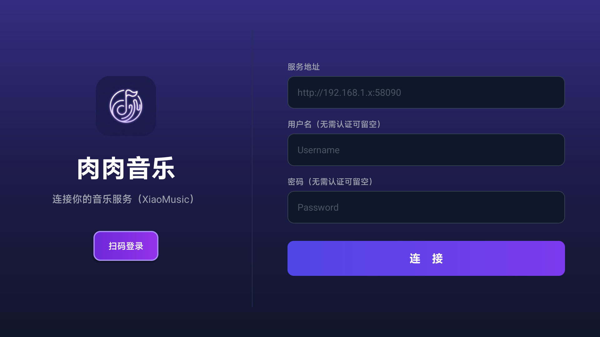
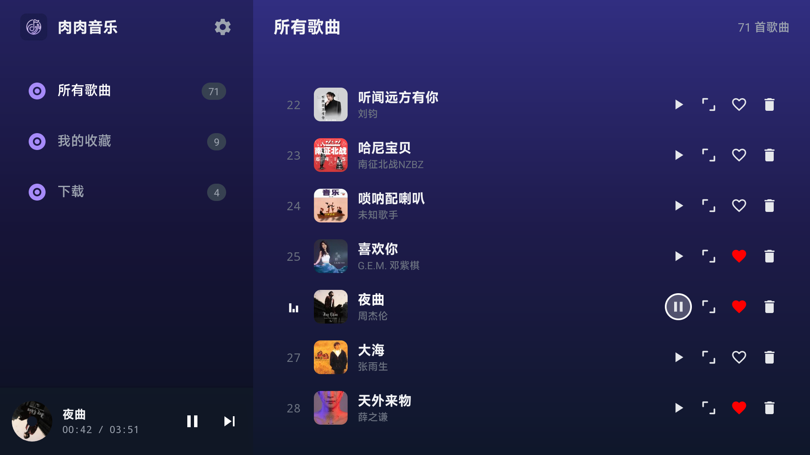
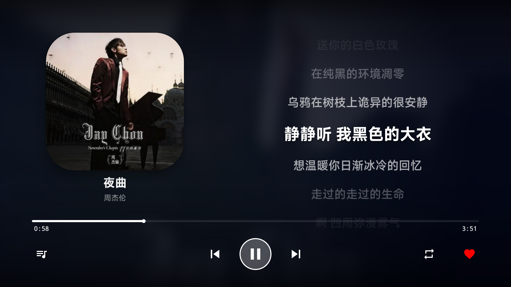

# RouRouMusic (肉肉音乐)

RouRouMusic (肉肉音乐) 是一款专门为 Android TV 开发的 [XiaoMusic](https://github.com/hanxi/xiaomusic) 原生客户端。它旨在为电视大屏幕提供极致的音乐播放体验，完美适配遥控器操作，拥有精美的毛玻璃视觉效果和歌词显示功能。

---

## ✨ 功能特点

- 📺 **电视原生界面**：针对大屏幕高度优化的 UI，大字体、清晰的焦点提示。
- 🎮 **全遥控器支持**：完全适配 D-Pad 操作，流畅的导航切换体验。
- 🎵 **沉浸式播放器**：
  - 基于专辑封面的动态毛玻璃背景。
  - 实时同步歌词显示。
  - 播放列表抽屉，支持快速切歌。
- 🔗 **便捷连接**：支持输入服务器地址，配合 `xiaomusic` 后端使用。
- 🚀 **原生性能**：基于 Android 原生 Java 开发，启动快、运行稳、占用低。

---

## 📸 界面预览

| 快速登录 | 歌曲列表 | 播放界面 |
| :---: | :---: | :---: |
|  |  |  |

---

## 🛠️ 安装与使用

### 下载运行
1. 前往本仓库的 [Releases](https://github.com/GanHuaLin/rouroumusic-tv/releases) 页面下载最新的 APK 文件。
2. 将 APK 安装到您的 Android TV 或电视盒子上。

### 初次配置
应用提供了两种配置方式：

1. **手机快速配置（推荐）**：
   - 启动应用后，电视屏幕会显示一个二维码或 IP 地址。
   - 使用手机浏览器访问该地址，即可在手机上输入服务器信息并一键推送到电视，免去遥控器输入的烦恼。
2. **手动输入**：
   - 使用遥控器直接在电视端输入您的 **XiaoMusic 服务端地址**（例如 `http://192.168.1.100:58090`）。

---

## 🏗️ 编译指南

如果您想自行编译此项目：

1. 克隆本仓库：
   ```bash
   git clone https://github.com/GanHuaLin/rouroumusic-tv.git
   ```
2. 使用 **Android Studio** 打开项目。
3. 等待 Gradle 同步完成。
4. 使用 Android Studio 的 `Build -> Build Bundle(s) / APK(s) -> Build APK(s)` 生成 APK。

**项目要求：**
- Android SDK 21 (Android 5.0) 或更高。
- Android Studio Chipmunk 或更高版本。

---

## 🤝 贡献与感谢

欢迎提交 Issue 或 Pull Request 来改进本项目。

- 特别感谢 [XiaoMusic](https://github.com/hanxi/xiaomusic) 提供的核心后端支持。

---

## 📄 开源协议

本项目采用 [MIT License](LICENSE) 协议。
